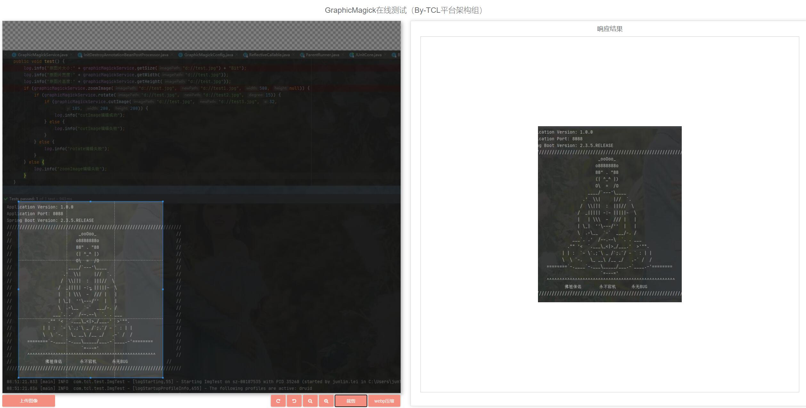

# graphic-magick-demo 使用说明：


###前言：

使用前，先安装graphic-magick 和cwebp

###功能：

1.webp压缩


2.graphic-magick图片旋转


3.graphic-magick图片缩放


4.graphic-magick图片裁剪



### 新增功能

去掉图片路由代理：
```
  /** 本地文件上传路径-建立资源映射/profile<==>file:///C://home/dev/tcl-file-server/data/ */
  //registry.addResourceHandler(Constants.RESOURCE_PREFIX + "/**").addResourceLocations("file:" + TclConfig.getProfile() + "/");
```

1.新增图片处理接口直接处理图片：

http://localhost/profile/upload/2021/08/17/3bc6f3f5-edb7-4028-9158-06e7e2ed2454.jpg

2.新增图片处理接口直接处理图片(处理原图和重新设置大小)：

http://localhost/profile/upload/2021/08/17/3bc6f3f5-edb7-4028-9158-06e7e2ed2454.jpg?process=resize,800*600

3.新增图片处理接口直接处理图片(转换成webp和重新设置图片大小)：
http://localhost/profile/upload/2021/08/17/3bc6f3f5-edb7-4028-9158-06e7e2ed2454.jpg?process=image/format,webp/resize,800*600
